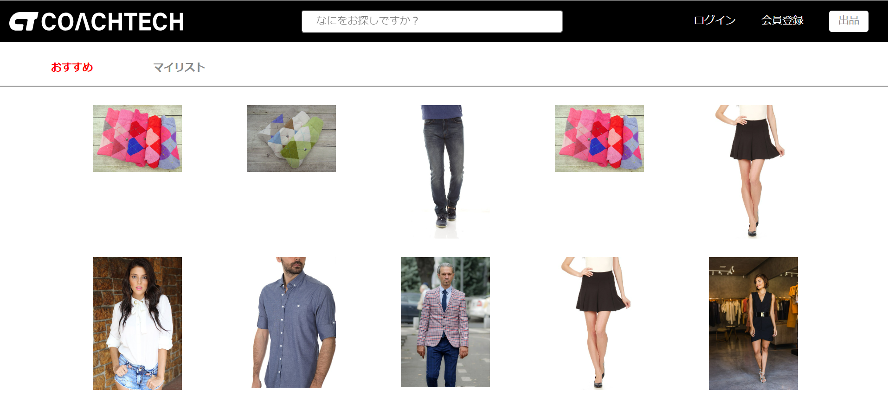

# market

フリーマーケットアプリケーションです。ユーザー登録をしなくても商品の閲覧は可能ですが、登録していただくと商品の購入、出品、お気に入り商品の登録、商品に対するコメント記入等の機能をご利用可能になります。

## 作成した目的

クライアントより自社ブランドの商品を出品するフリマアプリを持ちたいとの要望があった為、要望に添った機能を持つフリーマーケットサービスを構築するため作成しました。

## アプリケーション URL

### ローカル環境

http://localhost

### AWS を使用した本番環境

http://IP アドレス

## 機能一覧

・アカウント作成機能

・ログイン及びログアウト機能

・おすすめ商品一覧表示機能

・商品検索機能

・商品出品機能

・商品詳細表示機能

・お気に入り商品一覧表示機能

・商品お気に入り情報追加機能

・商品お気に入り情報削除機能

・商品コメント作成機能

・商品コメント削除機能

・支払方法選択機能

・配送先変更機能

・Stripe決済による商品購入機能

・ユーザー情報表示機能

・出品商品一覧表示機能

・購入商品一覧表示機能

・ユーザープロフィール変更機能

・管理者用管理画面表示機能

・ユーザー一覧表示機能

・ユーザーに対するメール送信機能

・ユーザー削除機能

・管理者用商品一覧表示機能

・商品別コメント一覧表示機能

・コメント削除機能

・出品商品とプロフィールの画像アップロード機能

## 使用技術

・Laravel 8

・nginx 1.21.1

・php 7.4.9

・html

・css

・mysql 8.0.26
