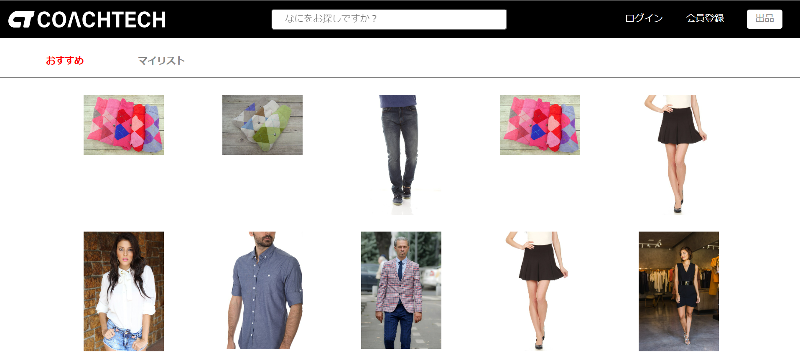
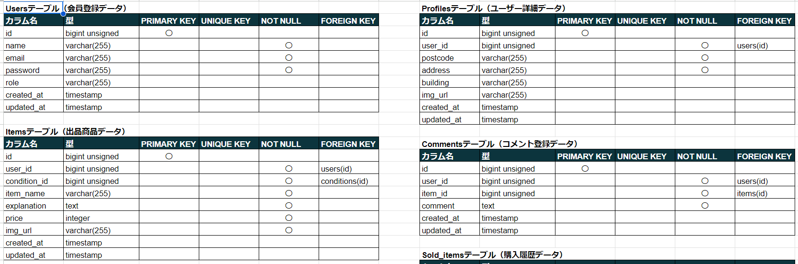
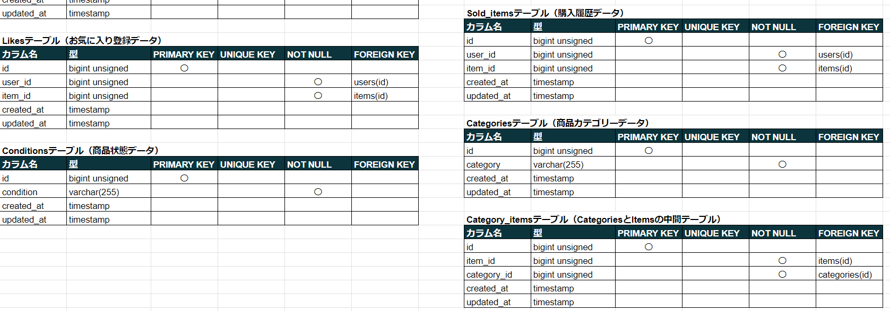
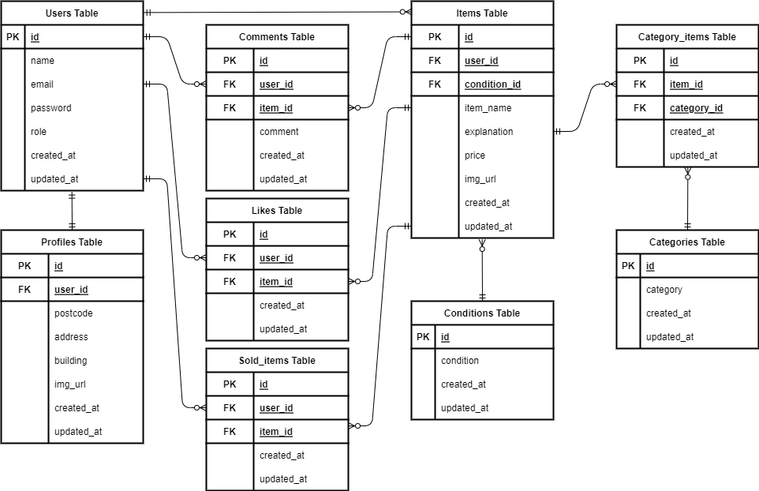
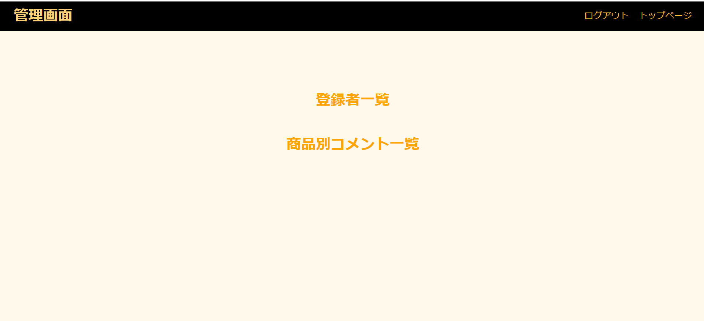
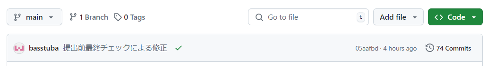

# market

フリーマーケットアプリケーションです。ユーザー登録をしなくても商品の閲覧は可能ですが、登録していただくと商品の購入、出品、お気に入り商品の登録、商品に対するコメント記入等の機能をご利用可能になります。

## 作成した目的

クライアントより自社ブランドの商品を出品するフリマアプリを持ちたいとの要望があった為、要望に添った機能を持つフリーマーケットサービスを構築するため作成しました。

## アプリケーション URL

### ローカル環境

http://localhost

### AWS を使用した本番環境

http://52.194.235.137

## 機能一覧

・アカウント作成機能

・ログイン及びログアウト機能

・おすすめ商品一覧表示機能

・商品検索機能

・商品出品機能

・商品詳細表示機能

・お気に入り商品一覧表示機能

・商品お気に入り情報追加機能

・商品お気に入り情報削除機能

・商品コメント作成機能

・商品コメント削除機能

・支払方法選択機能

・配送先変更機能

・Stripe決済による商品購入機能

・ユーザー情報表示機能

・出品商品一覧表示機能

・購入商品一覧表示機能

・ユーザープロフィール変更機能

・管理者用管理画面表示機能

・ユーザー一覧表示機能

・ユーザーに対するメール送信機能

・ユーザー削除機能

・管理者用商品一覧表示機能

・商品別コメント一覧表示機能

・コメント削除機能

・出品商品とプロフィールの画像アップロード機能

## 使用技術

・Laravel 8

・nginx 1.21.1

・php 7.4.9

・html

・css

・mysql 8.0.26

## テーブル設計

## ER図

# 環境構築

### 1 Gitファイルをクローンする

git clone git@github.com:basstuba/market.git

### 2 Dockerコンテナを作成する

docker-compose up -d --build

### 3 Laravelパッケージをインストールする

docker-compose exec php bash

でPHPコンテナにログインし

composer install

### 4 .envファイルを作成する

PHPコンテナにログインした状態で

cp .env.example .env

作成した.envファイルの該当欄を下記のように変更

DB_HOST=mysql

DB_DATABASE=laravel_db

DB_USERNAME=laravel_user

DB_PASSWORD=laravel_pass

MAIL_MAILER=smtp

MAIL_HOST=mail

MAIL_PORT=1025

MAIL_FROM_ADDRESS=tubatest@gmail.com

MAIL_FROM_NAME="${APP_NAME}"

**.envファイルの最後に追加**

STRIPE_KEY=stripeで取得した公開可能キー

**（今回は模擬案件ですので案件に使用しているテスト用キーを記述します。）**

STRIPE_KEY=pk_test_51PXLD8RpNmkMJF98BJ6A7RFg3blZCx4MO5saOR39gJJLW1MO8LDQBOdpDHbb0HcRoqz5uEr4Xhelc25cgdyqzIXK001BE3mHgc

STRIPE_SECRET=stripeで取得したシークレットキー

**（今回は模擬案件ですので案件に使用しているテスト用キーを記述します。）**

STRIPE_SECRET=sk_test_51PXLD8RpNmkMJF98JUVBR1gi1CxZOolYQT7bzXtpUD0jFAC1C3LHY1U5fkf9FB4hYFjYSneAWsxBIJmVKBUh3MZo00Ez8SOUiN

### 5 テーブルの作成

docker-compose exec php bash

でPHPコンテナにログインし(ログインしたままであれば上記コマンドは実行しなくて良いです。)

php artisan migrate

### 6 ダミーデータ作成

PHPコンテナにログインした状態で

php artisan db:seed

### 7 アプリケーション起動キーの作成

PHPコンテナにログインした状態で

php artisan key:generate

### 8 シンボリックリンクの作成

PHPコンテナにログインした状態で

php artisan storage:link

## 各種機能について

### 社名ロゴ

・社名ロゴを押すとトップページに戻ります。

### トップページ

・おすすめ商品はお気に入りの数が多い上位10件が表示されています。商品名又はカテゴリー名で検索すると上位10件に入っていない検索条件にあった商品も表示されます。

### 検索機能

・商品名又はカテゴリー名で検索可能です。キーワード入力欄にカーソルを合わせ何も入力せずにEnterを押すと全商品が表示されます。

### 出品ページのカテゴリー選択

・複数選択が可能です。2つ目以降を選択する時はCtrlを押しながらクリックしてください。

### 商品お気に入り情報追加機能と商品コメント作成機能及び購入ページ表示

・ログインしていないユーザーが使用しようとするとログインページに遷移する仕様になっています。これはもしログインしないと機能しない仕様にするとユーザーにエラーと勘違いされるかもしれないと思ったのと登録していないユーザーへ登録を促す意味があります。

・商品詳細ページ及びコメント作成ページにある☆を押すとお気に入りを追加、削除ができるようになっています。

・商品詳細ページにある💬を押すとコメント作成ページが表示され、コメント作成ページで押すと商品詳細ページに戻ります。

### 管理画面表示機能

・管理者用アカウントでログインすることによってログアウトの右側に管理画面へのリンクが表示されます。

**専用アカウント**

email -> coachtech@coachtech.com

password -> coachtech

### 管理画面

・画面左上の「管理画面」を押すとこの管理画面トップページに戻ります。

・登録者一覧からユーザーを閲覧でき、ユーザー宛のメール送信とユーザーの削除が行えます。

・商品別コメント一覧から全商品を閲覧でき、各商品の「コメント確認」ボタンで各商品のコメントが表示されて削除も行えます。

## PHP Unitによる単体テストについて

**.envファイルはセキュリティの観点からGitHubによる共有は望ましくない為.envファイルのみ作成お願い致します。**

### テスト実行方法

#### 1 .env.testingファイルの作成

docker-compose exec php bash

でPHPコンテナにログインし

cp .env.example .env.testing

で.env.testingファイルを作成。

#### 2 .env.testingファイルの修正

作成した.env.testingファイルの該当欄を下記のように変更。

APP_ENV=testing

DB_CONNECTION=mysql

DB_HOST=mysql

DB_PORT=3306

DB_DATABASE=market_test

DB_USERNAME=root

DB_PASSWORD=root

#### 3 APP_KEYの作成

docker-compose exec php bash

でPHPコンテナにログインし(ログインしたままであれば上記コマンドは実行しなくて良いです。)

php artisan key:generate --env=testing

.env.testingのAPP_KEY欄にbase64:~とkeyが記述されます。

#### 4 テスト用データベースにテーブル作成

PHPコンテナにログインした状態で

php artisan config:clear

でキャッシュクリアを実行してから

php artisan migrate --env=testing

又は

php artisan migrate:refresh --env=testing

#### 5 テスト実行

PHPコンテナにログインした状態で

php artisan test

テストの結果が表示されます。

## circle CIによるテストとデプロイの自動化について

・GitHubのリモートリポジトリの画面にて正常に動作しているのが確認していただけると思います。

　

・緑色のレ点が正常にテストとデプロイが終了した証となります。

## その他

### 1 ユーザー宛のメールは**MailHog**へ送信されるように設定しています。

#### ローカル環境

http://localhost:8025

#### AWSを使用した本番環境

http://52.194.235.137:8025

### 2 データベースのテーブルを確認できるphpMyAdminのURLは下記の通りです。

#### ローカル環境

http://localhost:8080

#### AWSを使用した本番環境

http://52.194.235.137:8080

### 3 docker-compose.ymlの設定はlocalhostでの接続設定になっています。

### 4 AWSの環境の確認はIAMユーザーを選択して”アカウントID「471112662470」",”ユーザーネーム「User-teat@account」” ,”パスワード「G-user/4202」”でログインしてください。

・リージョンは東京を選択すれば確認できます。

**閲覧のみ可能なアカウントです。採点終了後削除します。**

### 5 本番環境については採点が終了するまでEC2インスタンスを起動したままにしておきますので確認できると思います。